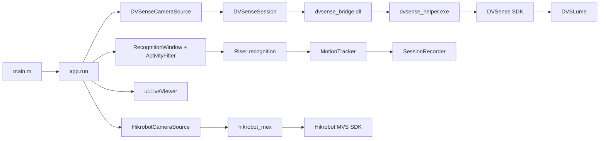
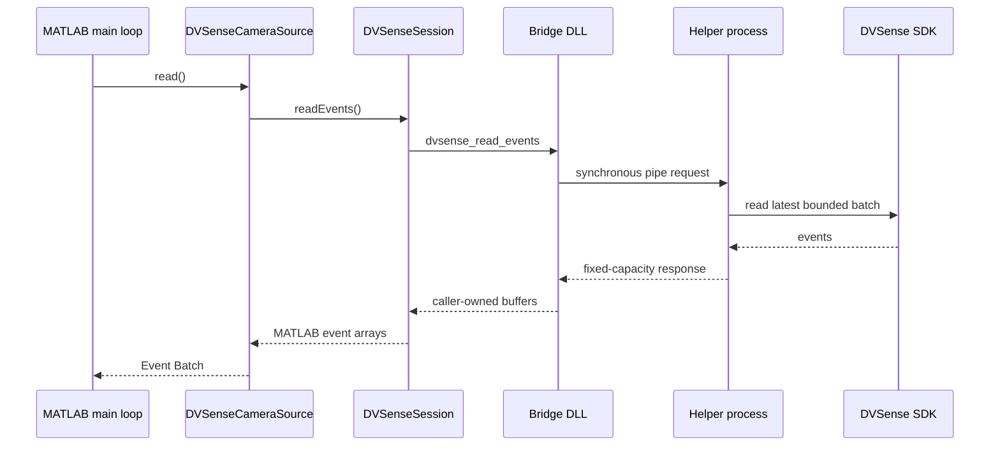

# Current Architecture

This document records the architecture implemented in the repository on
August 25, 2026. It describes the code as it exists, including incomplete
features and known risks.

## End-to-end structure



MATLAB does not load the vendor SDK DLLs directly. It loads the project C ABI
bridge. The bridge starts one isolated helper process, and the helper is the
only module that directly calls the DVSense SDK.

## Application composition

`main.m` constructs configuration, adds the private runtime directory, checks
the environment, and calls `app.run`. Configuration is loaded in order from
`config/default.json`, `config/camera-profile.json`, and optional
`config/local.json`; later files override earlier files. Fusion calibration is
required only when `fusion.calibrationEnabled` is true.

`app.run` owns:

- one camera source;
- one measurement backend used for display/measurement validation;
- one riser-analysis backend;
- one motion tracker;
- one activity filter;
- one fixed-capacity recognition accumulator;
- one session recorder;
- one live viewer.
- one optional Hikrobot RGB source, created only when the user connects RGB.

The viewer and all future child windows must remain observers of this shared
application state. They must not create data sources or camera sessions.

## RGB acquisition path

Hikrobot RGB acquisition is independent from the DVS Camera Session. The
application creates `HikrobotCameraSource` on demand, which uses
`hikrobot_mex` to enumerate, open, stream, convert, resize, control exposure,
and close one MVS camera. RGB failures close only the RGB source and do not
stop DVS acquisition or the workbench.

The native MVS chain was verified on August 25, 2026 with a Hikrobot
MV-CU050-90UC: exposure read/write/readback succeeded and a five-second run
returned 299 non-empty 2600x2160 frames with no frame-number gaps. Visual
Studio 2022 Build Tools was then installed alongside Visual Studio 2026;
MATLAB R2024b built the MEX and verified discovery, open, exposure control,
1280x720 RGB preview-frame delivery, and close through `HikrobotCameraSource`.

## Acquisition path



The helper SDK callback keeps two independent bounded products:

- the latest bounded event batch for recognition;
- a bounded timestamped display history used to render a full-resolution
  indexed `uint8` frame for the configured event accumulation window.

The display path does not reconstruct images from MATLAB event arrays.

## Recognition path

The configured 1 ms Event Batches are accumulated into a bounded 5 ms
Recognition Window. The current path is:

1. optional software ROI;
2. activity filtering;
3. event-image construction;
4. riser segmentation;
5. outline extraction;
6. centerline and curvature extraction;
7. motion estimation;
8. motion tracking;
9. result recording.

The recognition backend interface is stable, but the current
`GpuRiserAnalysisBackend` delegates processing to the CPU implementation. GPU
selection is therefore infrastructure readiness, not completed GPU
recognition.

Measurement and riser-analysis backends now live under `+analysis` with
explicit class names. The riser backend produces the result; the measurement
backend remains available for validation and display-oriented utilities.

## Display path

`app.run` calls `readDisplayFrame()` at a fixed internal 25 Hz and passes the
latest indexed frame to `ui.LiveViewer.update`. The user-facing `事件累计时间`
setting controls the native display history window independently of the fixed
1 ms camera callback batch and the recognition window. The display history is
reset when the window changes, the ROI changes, or the camera closes.

The current viewer:

- owns one `uifigure`;
- owns one fixed image object and updates only `CData`;
- draws bounding-box and position overlays;
- builds native MATLAB tabs and parameter controls;
- queues UI commands for the application loop;
- remains open when acquisition is stopped.

`ui.LiveViewer` is a stable facade over `ui.WorkbenchViewer`. The workbench
currently combines layout, frame rendering, parameter presentation, UI state,
and command translation in one large implementation.

## Lifecycle and camera ownership

The camera ownership chain is singular:

```text
app.run
  -> DVSenseCameraSource
  -> DVSenseSession
  -> bridge global state
  -> one helper process
  -> one SDK camera object
```

Normal startup:

1. load the bridge DLL;
2. start helper and communication pipes;
3. call `updateCameras()` and `getCameraDescs()` without opening a camera;
4. choose a serial number from the discovered devices;
5. open only the selected serial number;
6. read camera and Tool Parameter metadata;
7. apply the configured default Tool Parameter preset;
8. set batch time and optional hardware ROI;
9. start acquisition;
10. warm up several Event Batches.

Normal shutdown is protected by `onCleanup` and runs:

1. close the tracking recorder;
2. stop SDK Raw Recording;
3. stop and close the source/session/helper;
4. delete the viewer.

Stopping acquisition from the UI closes the source while keeping the
workbench alive. Starting again reopens the source.

## Process and thread model

- MATLAB main thread: application scheduling, synchronous source reads,
  recognition calls, recording calls, and GUI event pumping.
- Bridge DLL: in the MATLAB process, synchronous C ABI forwarding.
- Helper protocol thread: in the isolated helper process.
- DVSense callback thread: writes fixed latest-event and display buffers.
- MATLAB GPU execution: initiated and awaited by the MATLAB main loop.
- `uihtml`: Chromium rendering process for production status and controls;
  event frames remain native MATLAB graphics.

## Bounded memory

Long-lived buffers have fixed capacity:

- helper event buffers: two bounded event arrays;
- helper display buffers: two full-resolution indexed frames;
- MATLAB session pointers: bounded event arrays and one display frame;
- recognition accumulator: configured maximum event count;
- recorder: 256 tracking rows;
- viewer: one display image.

Recognition functions still allocate multiple temporary full-resolution
arrays per Recognition Window. The system has bounded growth, but recognition
allocation efficiency remains a separate optimization problem.

## Known risks

### High

- GPU recognition is not yet implemented despite GPU-capable status labels.
- Recognition creates significant temporary arrays.
- The 1 ms acquisition target is not guaranteed by the synchronous polling
  structure; a read can wait substantially longer.

### Medium

- The bridge and MATLAB library alias are process-global singletons.
- source-side cached Tool Parameter metadata can become stale after writes.
- several historical documents describe a MEX path or a non-helper final
  architecture that no longer matches production.

Bridge requests have bounded response timeouts. Discovery allows up to 15
seconds for a slow SDK response, connection/open and metadata requests allow
up to 30 seconds, and ordinary control/frame requests allow up to 2 seconds.

`DVSenseSession.close()` also calls the bridge close operation when the MATLAB
open flag is still false but the bridge library is loaded. This covers helper
startup and partial-open failures without requiring MATLAB to know whether the
SDK camera object was created.

The stable camera boundary is intentionally small:

```text
Camera discovery/selection -> DVSenseCameraSource -> DVSenseSession
                           -> C ABI bridge -> helper -> DVSense SDK
```

Recognition backends, display adapters, and future GPU kernels are outside
that boundary. They consume source packets and metadata through MATLAB
interfaces, so changing recognition or GUI implementation does not require
changing camera ownership or SDK protocol code.
