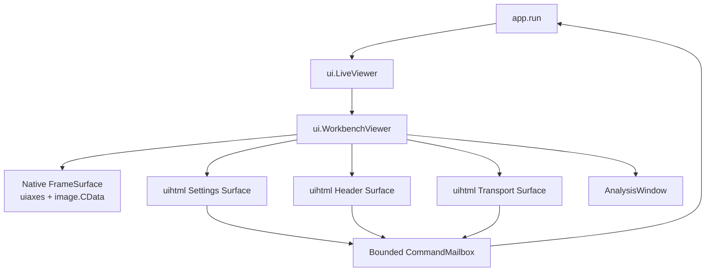
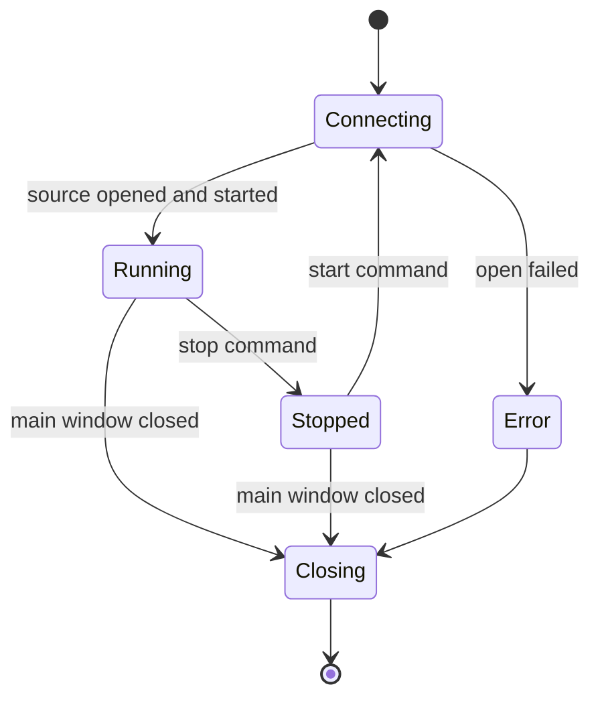

# Hybrid Production UI

**Status:** Proposed for implementation

## Goal

Replace the current monolithic native-control viewer with an official-style
production workbench that preserves the existing low-latency frame path,
single camera ownership, bounded memory, SDK-driven parameters, and reliable
shutdown.

## Scope

This specification covers:

- the `ui.LiveViewer` production seam;
- native MATLAB frame rendering;
- HTML control surfaces;
- UI command and state protocols;
- parameter presentation and write/readback;
- live, settings, and analysis window lifecycle;
- stop, restart, close, and error behavior;
- file ownership and migration from the manual prototype.

This specification does not redesign the bridge/helper protocol, implement
new recognition algorithms, or claim completed GPU acceleration.

## Current constraints

- MATLAB R2024b is the target runtime.
- The application supports one real DVSLume.
- One `DVSenseSession` and one helper process own the camera.
- Display refresh defaults to 25 Hz.
- Display pixels use indexed `uint8` values with:
  - background: RGB `[112 112 112]`;
  - ON event: white;
  - OFF event: black.
- Tool Parameter metadata comes from the connected SDK at runtime.
- GPU is requested by default, but the current GPU riser adapter still
  delegates recognition to CPU.

## Architectural decision

The workbench is hybrid:



`ui.LiveViewer` is a stable facade that delegates only to
`ui.WorkbenchViewer`.

## Why the frame stays native

The Display Frame must not cross the MATLAB/HTML seam.

Encoding a 1280×720 frame for `uihtml` at 25 Hz would create repeated
serialization, allocation, browser transfer, and decoding. It would also
duplicate the frame in MATLAB and Chromium memory and undermine the existing
fixed-image design.

The frame path remains:

```text
helper double buffer
  -> bridge caller-owned buffer
  -> MATLAB uint8 matrix
  -> existing image.CData
```

HTML receives only compact state and command messages.

## Production module interfaces

### `ui.LiveViewer`

`app.run` continues to construct `ui.LiveViewer(cfg)` and uses only:

```matlab
isRunning()
pumpEvents()
consumeCommands()
setConnectionStatus(text,state)
setCameraInfo(info)
setRunningState(value)
setRecordingState(value)
setToolParameters(parameters)
setToolParameterState(index,current)
setCommandError(command,message)
update(frame,track,stats)
setAnalysisResult(riserResult,track,backendState)
resetProcessingView()
delete()
```

The facade always delegates to `ui.WorkbenchViewer`. There is no legacy
production adapter.

### `ui.WorkbenchViewer`

This module owns workbench composition and state synchronization. It does not
own a data source, session, recorder, recognition backend, or camera.

It owns:

- the main `uifigure`;
- one `FrameSurface`;
- HTML header, settings, and transport surfaces;
- zero or one `AnalysisWindow`;
- one bounded `CommandMailbox`;
- one compact viewer-state structure.

### `ui.internal.FrameSurface`

Interface:

```matlab
FrameSurface(parent,cfg)
update(frame,track)
setOverlayVisible(value)
reset()
getImageHandle()
delete()
```

Invariants:

- creates one image object for its lifetime;
- `update` changes only `CData` and overlay properties;
- does not rebuild axes or layout during resize;
- keeps fixed coordinate limits matching the sensor;
- uses nearest-neighbor interpolation;
- stores no frame history.

### `ui.internal.HtmlSurface`

Interface:

```matlab
HtmlSurface(parent,htmlFile,eventHandler)
publish(payload)
delete()
```

It owns one `uihtml` control and translates `DataChangedFcn` callbacks into
validated event structures. It never executes application commands directly.

### `ui.internal.CommandMailbox`

Interface:

```matlab
push(command)
consume()
clear()
count()
```

Rules:

- maximum 64 pending commands;
- `stop`, `start`, `startRecording`, and `stopRecording` are never silently
  dropped;
- repeated `setRefreshHz` commands are coalesced;
- repeated Tool Parameter writes for the same `tool/name` are coalesced to
  the newest pending value;
- malformed or unsupported commands are rejected before insertion;
- `consume` atomically returns pending commands and clears the mailbox.

### `ui.AnalysisWindow`

The analysis window observes the latest Riser Observation and Motion Track.
It never opens or closes the camera. Closing it hides or deletes only that
window.

Initial fields:

- outline and centerline plot;
- point count;
- centerline length;
- confidence;
- maximum curvature;
- position and velocity;
- motion state;
- active recognition backend and fallback reason.

## UI protocol

HTML-to-MATLAB events are versioned structures:

```json
{
  "version": 1,
  "sequence": 42,
  "type": "setToolParameter",
  "payload": {
    "index": 3,
    "tool": "Biases",
    "name": "bias_diff_on",
    "value": 0
  }
}
```

Supported event types:

- `start`
- `stop`
- `startRecording`
- `stopRecording`
- `setRefreshHz`
- `setROI`
- `setToolParameter`
- `setOverlayVisible`
- `showAnalysis`
- `hideAnalysis`

MATLAB-to-HTML state messages are complete snapshots, not incremental DOM
instructions:

```json
{
  "version": 1,
  "revision": 108,
  "connection": {
    "state": "connected",
    "text": "相机已就绪，正在实时取流"
  },
  "run": {
    "active": true,
    "recording": false
  },
  "camera": {
    "product": "DVSLume",
    "serial": "ffffffffffffffaf",
    "width": 1280,
    "height": 720
  },
  "stats": {
    "timestampUs": 0,
    "eventCount": 0,
    "latencyUs": 0,
    "deadlineMisses": 0,
    "backend": "cpu"
  },
  "parameters": [],
  "parameterStatus": {}
}
```

Each HTML surface reads only the fields it owns. Unknown fields are ignored
to allow additive protocol evolution.

## Tool Parameter behavior

1. `startSource` reads the current SDK Tool Parameter table.
2. `setToolParameters` converts it into a presentation model without
   renaming SDK identifiers.
3. HTML creates controls from type and metadata:
   - `INT/FLOAT`: range slider, exact numeric field, decrement/increment;
   - `BOOL`: switch;
   - `ENUM`: SDK-provided option menu;
   - `STRING`: text field only when the SDK reports that type.
4. The HTML control enforces visible limits for usability.
5. MATLAB validates again with `camera.validateToolParameter`.
6. The command enters the mailbox.
7. `app.run` calls `src.setToolParameter`.
8. source/session/helper/SDK validate and write.
9. the SDK value is read back.
10. `setToolParameterState` publishes the confirmed value.

The UI must distinguish:

- modified locally;
- waiting for write;
- applied and read back;
- rejected with an error message.

No value is displayed as applied before SDK readback.

## Application command handling

UI callbacks do not call source methods. `app.run` remains the only module
that applies camera-affecting commands.

Nonfatal command errors, such as an invalid parameter write, are caught per
command and reported through `viewer.setCommandError`. They do not terminate
the acquisition loop.

Camera open, helper protocol, or frame-read failures are fatal to the current
run. The viewer shows the error, and `onCleanup` releases recorder, RAW
recording, source, helper, and UI resources.

Before the official viewer becomes the production default, every bridge
request must have a bounded response timeout and must detect helper-process
exit. A stalled or terminated helper must produce a fatal protocol error
instead of blocking `app.run`, GUI callbacks, or shutdown indefinitely.

## Run-state lifecycle



Stopping acquisition:

- closes the source/session/helper;
- leaves the main workbench open;
- changes the control to `开始运行`;
- clears visible overlays;
- clears pending recognition accumulation;
- resets riser motion history and Kalman timestamps;
- preserves UI layout and parameter presentation for reference.

Starting again:

- opens one new Camera Session;
- refreshes camera and Tool Parameter metadata;
- resets processing state before accepting new timestamps;
- changes the control to `停止运行` only after successful startup.

Closing the analysis child window never changes Run State.
Closing the main workbench ends `app.run` and triggers unified cleanup.

## Refresh rates

- Event Batch acquisition: controlled by the native batch time.
- Recognition Window: configured independently, currently 5 ms.
- Display Frame: default 25 Hz.
- compact runtime stats to HTML: maximum 10 Hz.
- Tool Parameter state: on connection, write, readback, or explicit refresh.
- analysis plots: maximum 10 Hz unless profiling proves a lower rate is
  necessary.

HTML surfaces do not receive state on every acquisition iteration.

## Memory rules

- one Display Frame exists in the production viewer;
- no UI frame history;
- no Base64 or PNG frame conversion;
- compact state snapshots stay below 256 KB;
- pending UI commands are bounded to 64;
- analysis plots retain only the latest result;
- HTML event listeners are installed once per surface;
- deleting a surface clears MATLAB callbacks and its data payload.

## Window and resize behavior

- the main window is DPI-aware and starts within the current monitor work
  area;
- resizing changes grid allocation only;
- the image object, axes, HTML surfaces, and parameter model are not rebuilt;
- full-screen mode preserves sensor coordinates and aspect ratio;
- child windows can remain open side by side;
- text must not overlap or be clipped at 100%, 125%, 150%, and 175% Windows
  scaling.

## Visual contract

The canonical design source is
`docs/ui-design/final/dvsense_final_visual.html`.

Production styling uses:

- white work surfaces;
- light gray navigation and group backgrounds;
- restrained DVSense blue selection and title color;
- official event gray/white/black palette;
- small-radius controls and restrained shadows;
- one DVS camera only;
- no APS controls;
- no alternative event color themes.

## Testing strategy

### Unit tests

- UI event schema and command mapping;
- command mailbox capacity and coalescing;
- Tool Parameter presentation model;
- complete state snapshot encoding;
- run-state labels and transitions;
- processing-state reset.

### Integration tests

- `LiveViewer` facade selects the official adapter;
- frame update preserves one image handle;
- HTML surfaces receive compact state without frame bytes;
- UI events appear as application commands;
- parameter writes require readback before applied state;
- child-window close does not stop the camera-owning application;
- main-window close makes `isRunning` false.

### Manual UI checks

- 100%, 125%, 150%, and 175% scaling;
- normal, maximized, and full-screen layouts;
- rapid stop/start;
- parameter scrolling and long enum values;
- analysis window side by side;
- 30-minute memory and flicker observation.

### Hardware acceptance

- real camera open/read/stop/start/close;
- parameter write/readback;
- RAW start/stop;
- helper termination after normal and forced close;
- no residual camera owner;
- stable memory and display for 30 minutes.

## Migration

1. build pure protocol and mailbox modules with tests;
3. build native `FrameSurface`;
4. build HTML surfaces from production assets;
5. assemble `OfficialLiveViewer`;
6. select it through `cfg.display.viewer = "official"`;
7. run camera-free tests;
8. run manual GUI checks;
9. run hardware acceptance;
10. keep the official viewer as the sole production implementation.

## Acceptance criteria

- the production default is the official hybrid viewer;
- `app.run` does not depend on concrete HTML or graphics controls;
- live frames never enter `uihtml`;
- one image handle survives all updates and resizes;
- all 26 current Tool Parameters render from runtime metadata;
- invalid values cannot reach the source;
- applied values require SDK readback;
- stop changes the control to start without closing the workbench;
- restart resets processing timestamps and state;
- closing the main window releases helper and camera;
- child windows do not own or release the camera;
- bridge requests cannot block forever when the helper stalls or exits;
- default automated tests pass without a camera;
- hardware acceptance leaves no residual process or camera lock.
